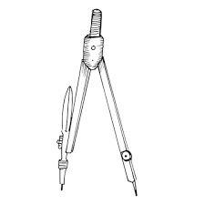
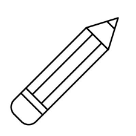
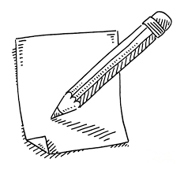
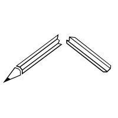
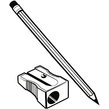

# *PETA #3 - Cudia, Lucky Vincent*

---

### *Compass*

|  | The compass pencil shows a perfect world, where despite problems, having my friends and family makes life feel great. Even sometimes things aren't perfect, looking at the bright side helps me to find solutions, like adjusting a compass to make a perfect circle despite small mistakes. |

---

### *Pencil*

A regular pencil is me, Because im the one who's controlling my life with the choices I make, whether they're good or bad.

---

### *Pencil & Paper*

Friends, family, and other peoples are like pencils and paper, they are the one whos guiding me to be a better or worse version of myself.

---

### *Broken Pencil*

My father is like a broken pencil, hes still keeps going despite tough times, he's doing he's best working hard for our future.

---

### *Sharpened Pencil*

Feeling alive is like a sharpened pencil, thanks to support from family and friends who always push me to chase my dreams and do what i want to do to be better version of me.

--- 
